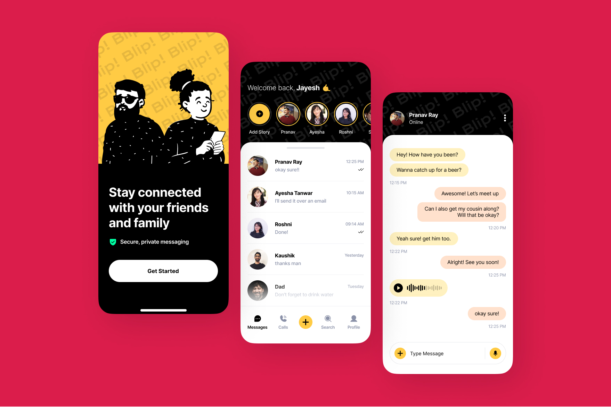

Chat App UI in React Native
> 

# React Native

React Native is a popular JavaScript framework that allows you to build native mobile apps using a single codebase. You will learn how to develop cross-platform mobile applications for both iOS and Android platforms, leveraging the efficiency and flexibility of React Native.

# Hybrid App Development

By using React Native, you will gain experience in building hybrid mobile apps, which provide the advantage of code reusability across multiple platforms. This project will help you understand the fundamentals of hybrid app development and how to leverage the strengths of React Native to deliver a consistent user experience on both iOS and Android.

# Clone a whole Project
To clone a React Native project from GitHub, follow these simple steps:

1): Install Git: Make sure you have Git installed on your system. You can download and install it from the official Git website.

2): Navigate to GitHub: Go to the GitHub repository of the React Native project you want to clone.

3): Clone the Repository: On the GitHub repository page, look for the green 'Code' button. Click on it to reveal a URL. You can choose between HTTPS and SSH URLs. If you're new to this, start with HTTPS.

4): Open Terminal or Command Prompt: Open your terminal or command prompt on your local machine.

5): Navigate to Desired Directory: Use the cd command to navigate to the directory where you want to store the cloned project. For example:
cd Documents/Projects

6): Clone the Repository: In the terminal, paste the URL you copied from the GitHub repository and use the git clone command to clone the project. For HTTPS URL:
cd repository-name

7): Install Dependencies: React Native projects usually have dependencies that need to be installed. Run the following command to install them:
npm install

8): Start the Frontend React Native Project: Depending on the project, you might have different ways to start it. Typically, for a React Native project, you would use:
npm start or npx react-native start

Explore the Project: The cloned React Native project is now running on your local machine. You can explore the code, make modifications, and see the changes live on the emulator or device.

10): By following these steps, you'll successfully clone a React Native project from GitHub and have it up and running on your local development environment."

# To start the React Native server

npm start &  npx react-native start
